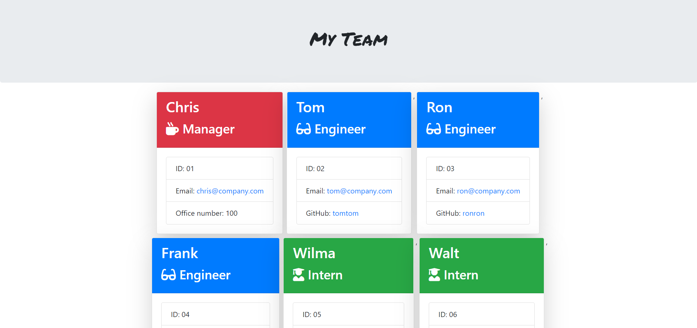
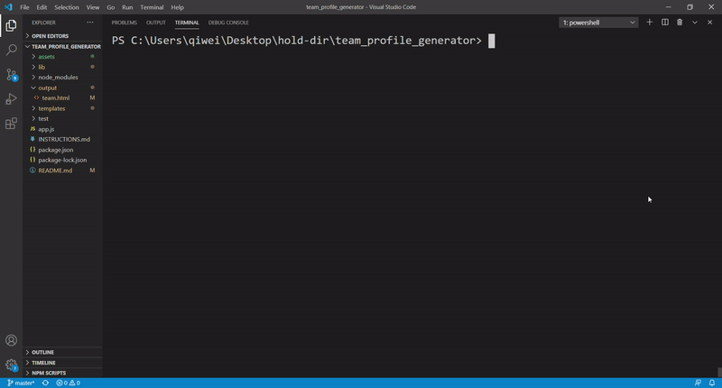

# Team Profile Generator
[](https://github.com/dwyl/esta/issues)


## Description
The Team Profile Generator creates a stylized HTML file utilizing inputs from a manager. The manager answers a series of questions regarding himself and his teammates. Once the manager has answered all of the questions for his/her full team, the app will generate a webpage that provides the manager with easy access to his/her team's basic info.

## Output Example



## Table of Contents
* [Background](#background)
* [Approach](#approach)
* [Tools](#tools)
* [Installation](#installation)
* [Usage](#usage)
* [License](#license)
* [Contributing](#contributing)
* [Tests](#tests)
* [Questions](#questions)
* [Authors](#authors)

## Background
The objective of this exercise was to build an app for managers to easily view his/her team's basic info on a stylized webpage.

Acceptance criteria is as follows:

```
* Functional application.

* GitHub repository with a unique name and a README describing the project.

* User can use the CLI to generate an HTML page that displays information about their team.

* All tests must pass.
```

## Approach
This project featured three areas which required specific focus:
1) Building classes and leveraging inheritance
2) Setting up inquirer to capture user inputs
3) Running the html renderer

### Class setup and inheritance
The employee class is the parent class for manager, engineer, and intern.  Below is the structure utilized for employee:
```
class Employee{
    constructor(name, id, email){
        this.name = name;
    this.id = id;
    this.email = email;
    this.getName = function () {
        return this.name;
    };
    this.getId = function () {
        return this.id;
    };
    this.getEmail = function () {
        return this.email;
    };
    // this.getRole = function () {
    //     return "Employee";
    // }
    }
}
```

To inherit methods from employee by utilizing 'extends':
```
const Employee = require("./Employee.js");

class Engineer extends Employee{
    constructor(name,id,email,github){
        super(name,id,email);
        this.github = github;
        this.getGithub = function (){
            return this.github;
        }
    }
}

Engineer.prototype.getRole = function() {return "Engineer"};
```
### Capturing User Inputs
User inputs ask for manager details first. Subsequently, engineers and interns can be added as needed. To allow for repeated use, a recursive approach was used by setting a flag in a nested function:
```
const teammate = function () {
            let stopFlag = false;
            if (stopFlag === false) {
                // checks to see what role the new teammate performs
                inquirer.prompt([
```
The flag is updated at the end of each prompt within the function.

## Tools

* [HTML](https://developer.mozilla.org/en-US/docs/Web/HTML)
* [CSS](https://developer.mozilla.org/en-US/docs/Web/CSS)
* [Bootstrap](https://getbootstrap.com/)
* [JS](https://developer.mozilla.org/en-US/docs/Web/JavaScript)
* [jquery](https://jquery.com/)
* [Inquirer](https://www.npmjs.com/package/inquirer#prompt)
* [Jest](https://www.npmjs.com/package/jest)

## Installation
To install this app, users must download the contents of this repository, excluding the package-lock.json file and node_modules folder, onto their local harddrive. Once copied, from terminal, the user must type in 'npm install' to install the required modules for this app to function.

## Usage
To use the app, simply type in 'node app.js' from your terminal while in the directory which contains the app.js. Answer the series of the questions prompted inside the terminal and an html file will generate in the 'output' folder once completed. See below for detailed usage examples.



[Video](https://drive.google.com/file/d/1UD9hBmPsqhv2v2lVGR_CJMrmLX2AA46L/view?usp=sharing)

## License
MIT

## Contributing
Contributors are welcome. Please contact for further details.

## Tests
Tests have been designed for this app to ensure that class design and output meet required functionality specifications. To run, simply type in 'npm run test' from your terminal while in the directory which contains the app.js.

## Questions
If you have any questions regarding this project, please email me at: qiwei.mod@gmail.com

## Authors

* **CHRISTOPHER LEE** 

- [Link to Github](https://github.com/CofChips)
- [Link to LinkedIn](https://www.linkedin.com/in/christophernlee/)
